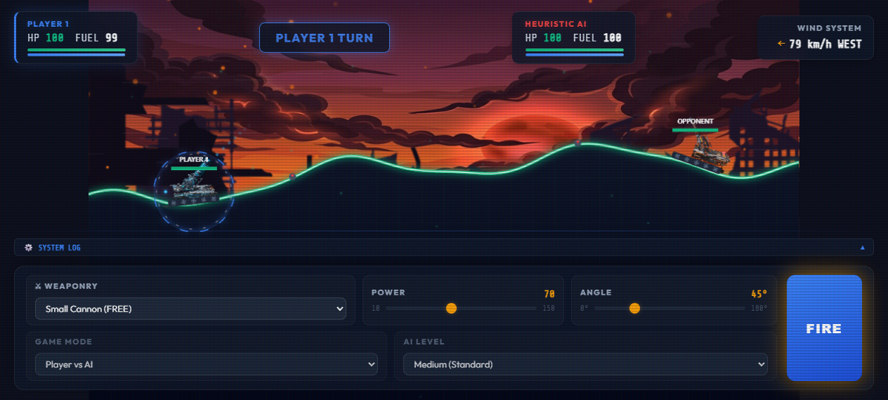
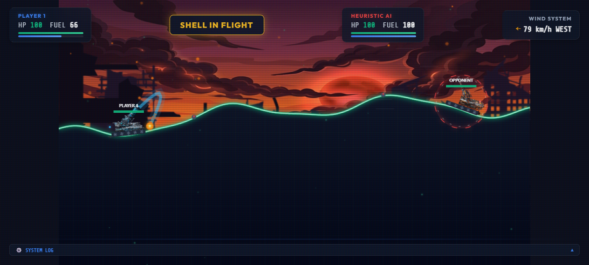
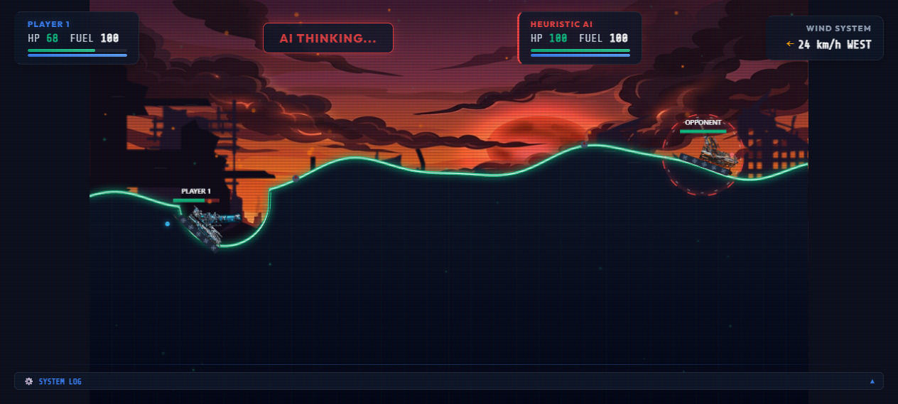

# 🚀 Tank Wars: Destructible Cyberpunk Battleground

A high-juice, responsive HTML5 artillery game featuring destructible vector terrain, advanced physics balancing, real-time serverless multiplayer, and optimized touch controls for mobile and desktop cross-play.

👉 **[PLAY ONLINE NOW!](https://rorrimaesu.github.io/TankWarzReboot/)**

---

## 🎮 Gameplay Preview

| Lobby Menu | Tank Movement |
| :---: | :---: |
|  |  |
| **Projectile Flight** | **Explosion & Destructible Terrain** |
|  |  |

---

## 🕹️ Key Features

*   **Realtime Online Multiplayer**: Instant matchmaking ("Quick Match") and private game rooms (4-letter invite codes) powered entirely client-side using Ably's serverless WebSocket cloud.
*   **Destructible Cyberpunk Terrain**: Procedural twilight skylines with glowing neon windows, perspective grids, glowing emerald vector coastlines, and a matrix-circuit ground fill that dynamically deforms on impact.
*   **Responsive Mechanical Rigging**: Smooth chassis bobbing suspension, rotating spoked wheels, and spring-damped gun recoil kickbacks.
*   **High-Juice Particle Emitters**: Projectile trail embers, terrain-bouncing explosion sparks (with physical gravity friction reflection), expanding shockwaves, supply crate beacon beams, and an arcade CRT monitor filter.
*   **Tactical Weaponry Sandbox**:
    *   `Small Cannon`: Baseline free cannon.
    *   `Heavy Mortar`: Slow arcing shell dealing heavy damage.
    *   `Rapid Fire`: Three-round burst of high-velocity shells.
    *   `Dirt Spreader`: Terraform mounds to create shields or climb hills.
    *   `Tactical Nuke`: High fuel cost, screen-flashing massive explosion radius.
    *   `Cluster Bomb`: Splits at trajectory apex into three downwards bomblets.
    *   `Bouncing Grenade`: Purple trails bouncing off terrain slopes up to 3 times.
*   **AI Controller**: Smart heuristics adjusting shots for wind drag and gravity.

---

## 📱 Desktop & Mobile Controls

### Desktop (Keyboard & Mouse)
*   **Move**: `A` / `D` or `ArrowLeft` / `ArrowRight` (consumes fuel).
*   **Aim**: Adjust the **Power** and **Angle** range sliders in the command deck.
*   **Weapon selection**: Choose your ordnance in the weaponry dropdown menu.
*   **Fire**: Click the **FIRE** button.

### Mobile (Touch Gestures)
*   **Move**: Tap and hold the on-screen virtual D-pad buttons (◀ and ▶) in the bottom corners.
*   **Direct Aim**: Touch your tank and drag backward and down (pull-back style, similar to *Angry Birds*). An interactive vector trajectory path will draw on screen.
*   **Fire**: Release your finger from the drag vector to deploy the shell.
*   *Note: Landscape mode is recommended. Rotate your device to trigger landscape orientation automatically.*

---

## 🛠️ Technology Stack

*   **Frontend**: HTML5 Canvas, Vanilla CSS3 (Custom transitions, gradients, CRT overlays), TypeScript.
*   **Realtime Network Layer**: [Ably Realtime Cloud](https://ably.com/) WebSockets (with dynamic testing key provisioning).
*   **Build & Deployment**: TypeScript Compiler (`tsc`), automated CI/CD pipeline via GitHub Actions to GitHub Pages.
